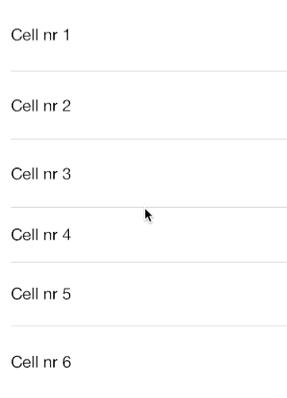

# DSSwipeTableViewCell

##### A drop-in replacement for `UITableViewCell` with horizontal scrolling to reveal a custom view, similar to Apple's swipe to delete button.

## Installation

#### CocoaPods
add `pod 'DSSwipeTableViewCell'` to your podfile.

#### Manual
Copy files in DSSwipeTableViewCell/ into your project and import DSSwipeTableViewCell.h in your `UITableViewController`.

## Usage

Use as a drop-in replacement for `UITableViewCell`. Enable and disable the swipe areas and add content to them.

``` objective-c
- (UITableViewCell *)tableView:(UITableView *)tableView cellForRowAtIndexPath:(NSIndexPath *)indexPath
{
    static NSString *CellIdentifier = @"Cell";
    DSSwipeTableViewCell *cell = [tableView dequeueReusableCellWithIdentifier:CellIdentifier];
    
    if (cell == nil) {
        cell = [[DSSwipeTableViewCell alloc] initWithStyle:UITableViewCellStyleSubtitle reuseIdentifier:CellIdentifier];
    }
    
    // Configure the cell...
    
    cell.textLabel.text = @"Text label";
    cell.detailTextLabel.text = @"Subtitle label";
    
    cell.imageView.image = [UIImage imageNamed:@"image.png"];
    
    cell.rightAreaEnabled = YES;
    cell.leftAreaEnabled = NO;

    cell.leftAreaWidth = 100;
    cell.rightAreaWidth = 200;
    
    cell.leftArea.backgroundColor = [UIColor yellowColor];
    cell.rightArea.backgroundColor = [UIColor redColor];
    
    return cell;
}
```

Although you should really subclass `DSSwipeTableViewCell` and then add content to the left and right areas.

## Demo



## Requirements

`DSSwipeTableViewCell` is compatible with iOS 7.0+

## Contact

Donovan Söderlund

- http://github.com/DonovanSoderlund
- http://twitter.com/DonovanSoder

## License

DSSwipeTableViewCell is available under the MIT License (MIT)
